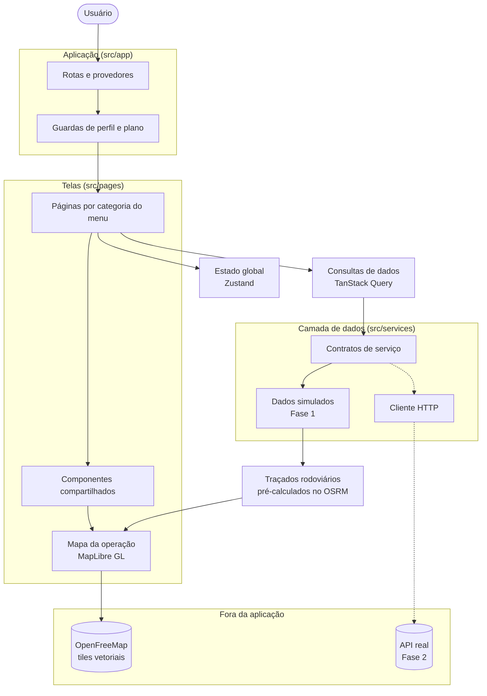

<p align="center">
  <picture>
    <source media="(prefers-color-scheme: dark)" srcset="public/logo/logo-rookhub-white.svg"/>
    
  </picture>
</p>

<h2 align="center">Frontend</h2>

<p align="center">
  <strong>Plataforma SaaS de gestão inteligente de frotas</strong><br/>
  Telemetria, manutenção, viagens e custos das transportadoras rodoviárias de carga em um só lugar. <em>A inteligência por trás de cada frota.</em>
</p>

<div data-importer="techs" align="center">
  
  
  
  
  
  
  
  
  
  
  
  
  
  
  
</div>

---

## Sobre o projeto

### O problema

Uma transportadora rodoviária de carga acompanha sua operação em pedaços: o rastreador fica
num site, o controle de abastecimento numa planilha, as multas chegam por e-mail, a
manutenção vive na agenda do mecânico e o custo por quilômetro só aparece no fechamento do
mês. Nesse ponto já não dá para corrigir. O gestor gasta o dia juntando informação em vez de
decidir com ela.

### A proposta

O **RookHub** é uma plataforma **SaaS** que reúne essa operação em um lugar só: telemetria,
rastreamento, viagens, motoristas, abastecimentos, manutenção, multas e listas de
verificação. Sobre esses dados roda uma camada de **inteligência artificial** que não se
limita a exibir números. Ela aponta o que merece atenção agora: o veículo que passou a
consumir mais, a viagem com risco de atraso, a manutenção que está prestes a virar
problema.

Sendo SaaS, cada transportadora é um **tenant** isolado, com seus próprios usuários. O que
cada pessoa enxerga depende de duas coisas: o **perfil de acesso** (gestor de frota,
administrador, motorista…) e o **plano contratado**, que libera ou bloqueia módulos como IA
e relatórios analíticos.

### O que existe hoje neste repositório

Este é o **frontend**, na **Fase 1 (MVP)**, e o objetivo dela é deliberadamente estreito:
provar a experiência de ponta a ponta antes de existir backend. A aplicação está navegável,
responsiva e visualmente fechada, rodando com **dados simulados**.

O ponto central da arquitetura é que as telas **nunca conversam com os dados simulados**.
Elas dependem de contratos de serviço (`src/services`); a simulação é só a implementação
atual desses contratos. Quando a API real entrar, na Fase 2, troca-se a implementação, e
nenhuma tela precisa ser reescrita.

O que **não** faz parte desta fase: backend, banco de dados, autenticação real, cobrança,
telemetria de verdade e chamadas a modelos de IA.

### Destaques

- Painel com indicadores, gráficos e mapa real da operação (MapLibre + OpenFreeMap, sem chave de API)
- Módulos de veículos, motoristas, viagens, manutenção, abastecimentos e multas
- Rotina de pátio do operador: lançamento de documentos e triagem dos checklists recebidos
- Painel de gestão do proprietário e do gestor, com resultado consolidado, liberações e pareceres
- Controle de acesso por perfil e liberação de módulos conforme o plano do cliente
- Assistente de inteligência artificial e área de administração da plataforma
- Camada de dados simulada, isolada atrás de contratos de serviço
- Interface responsiva com **tema escuro** por padrão e tema claro preparado

### Duas áreas, dois sistemas visuais

O produto tem duas casas, e cada perfil entra na sua:

- **Painel operacional** (`/app`): operador e manutenção. Visual shadcn/ui sobre tokens OKLCH.
- **Painel de gestão** (`/gestao`): proprietário e gestor. Telas trazidas do monorepo
  `System-mobile`, com o design de vidro sobre grafite que já tinham. Elas vivem em
  `src/management/` e carregam os próprios tokens, escopados na classe `.management-theme`
  para não vazarem para o resto da aplicação.

---

## Tecnologias utilizadas

| Categoria     | Ferramenta                                                                         | Versão                  |
| ------------- | ---------------------------------------------------------------------------------- | ----------------------- |
| Execução      | [Node.js LTS](https://nodejs.org/pt-br/download)                                   | 24.18.0                 |
| Gerenciador   | npm                                                                                | 11.16.0                 |
| Biblioteca UI | [React](https://react.dev/)                                                        | 19.2.8                  |
| Linguagem     | [TypeScript](https://www.typescriptlang.org/)                                      | 6.0.3                   |
| Empacotador   | [Vite](https://vitejs.dev/)                                                        | 8.1.5                   |
| Estilização   | [Tailwind CSS](https://tailwindcss.com/)                                           | 4.3.3                   |
| Componentes   | [shadcn/ui](https://ui.shadcn.com/) (`new-york`) sobre Radix UI                    | n/a                     |
| Roteamento    | [React Router](https://reactrouter.com/)                                           | 8.2.0                   |
| Dados e cache | [TanStack Query](https://tanstack.com/query)                                       | 5.101.4                 |
| Estado global | [Zustand](https://zustand.docs.pmnd.rs/)                                           | 5.0.14                  |
| Formulários   | [React Hook Form](https://react-hook-form.com/) + [Zod](https://zod.dev/)          | 7.82.0 / 4.4.3          |
| Gráficos      | [Recharts](https://recharts.org/)                                                  | 3.10.0                  |
| Mapas         | [MapLibre GL](https://maplibre.org/) + [OpenFreeMap](https://openfreemap.org/)     | 5.24.0                  |
| Ícones        | [Lucide](https://lucide.dev/) · [Phosphor](https://phosphoricons.com/) (`/gestao`) | 1.25.0 / 2.1.10         |
| Testes        | [Vitest](https://vitest.dev/) + Testing Library + jsdom                            | 4.1.10                  |
| Qualidade     | ESLint / typescript-eslint / Prettier                                              | 10.7.0 / 8.65.0 / 3.9.6 |

> **TypeScript fixado em 6.0.3 de propósito.** A 7.0.2 já é estável, mas o `typescript-eslint@8.65.0` declara peer `typescript >=4.8.4 <6.1.0` e subir agora quebraria o lint. O projeto já está preparado para o TS 7 (sem `baseUrl`, sem `ignoreDeprecations`).

---

## Estrutura do projeto

```
Rookhub/
├── docs/
│   ├── referencias/            # Referências visuais do produto (não remover)
│   └── ARQUITETURA_FRONTEND.md # Decisões técnicas
├── public/
│   ├── images/                 # Imagens da interface
│   └── logo/                   # Logotipo e ícone da marca
├── src/
│   ├── app/                    # Rotas, provedores, navegação, permissões e planos
│   ├── pages/                  # Telas agrupadas pelas categorias do menu
│   │   ├── login/              # Acesso: entrar, recuperar senha, convite
│   │   ├── dashboard/          # Painel inicial
│   │   ├── operations/         # Frota, veículos, motoristas, viagens, rastreamento
│   │   ├── costs/              # Abastecimentos, manutenções, multas, checklists
│   │   ├── intelligence/       # IA, analytics e alertas
│   │   ├── administration/     # Integrações, configurações e planos
│   │   ├── saas/               # Administração da plataforma
│   │   └── misc/               # Página não encontrada e sessão expirada
│   ├── components/
│   │   ├── ui/                 # Componentes do shadcn/ui
│   │   ├── layout/             # Menu lateral, barra superior e estrutura das páginas
│   │   └── shared/             # Tabelas, gráficos, cards, filtros, estados e guardas
│   ├── management/             # Painel de gestão (proprietário e gestor), em /gestao
│   │   ├── ui/                 # Primitivos de vidro próprios deste painel
│   │   ├── components/         # Layout, navegação e banner do painel
│   │   ├── features/           # Telas por domínio (dono, gestor, frota, custos…)
│   │   ├── mocks/              # Dados simulados do painel
│   │   ├── styles/             # Tokens do painel, escopados em `.management-theme`
│   │   └── types.ts            # Tipos de domínio do painel
│   ├── hooks/                  # Sessão, permissões, plano e consultas de dados
│   ├── lib/                    # Formatação, datas e mapeamento de situações
│   ├── mocks/                  # Dados simulados, fora dos componentes
│   ├── services/               # Contratos, implementações simuladas e cliente HTTP
│   ├── stores/                 # Estado global (sessão, tema, menu lateral)
│   ├── styles/                 # Tokens de tema e estilos globais
│   ├── test/                   # Configuração do Vitest
│   └── types/                  # Tipos de domínio
├── index.html
├── package.json
├── tsconfig.json
└── vite.config.ts
```

Os testes ficam ao lado do código que exercitam (`*.test.ts` / `*.test.tsx`).

---

## Arquitetura

As telas nunca acessam os dados simulados diretamente: elas dependem apenas dos contratos em `services`. Trocar a simulação pela API real, na Fase 2, não exige reescrever nenhuma tela.



Consulte [`docs/ARQUITETURA_FRONTEND.md`](docs/ARQUITETURA_FRONTEND.md) para as decisões técnicas.

---

## Como executar

### Pré-requisitos

| Ferramenta | Versão   | Download                          |
| ---------- | -------- | --------------------------------- |
| Node.js    | 24 LTS   | https://nodejs.org/pt-br/download |
| npm        | 11+      | Incluído com o Node.js            |
| Git        | qualquer | https://git-scm.com/downloads/win |

A versão do Node está fixada no `.nvmrc` e exigida por `engines.node`.

### Passos

```bash
# 1. Clonar o repositório
git clone https://github.com/v2ntechnology/Rookhub.git
cd Rookhub

# 2. Instalar dependências
npm install

# 3. Criar o arquivo .env na raiz (ignorado pelo Git). Veja a seção abaixo

# 4. Rodar em ambiente de desenvolvimento
npm run dev
```

Acesse em [http://localhost:5173](http://localhost:5173).

### Scripts disponíveis

| Comando                | Descrição                                           |
| ---------------------- | --------------------------------------------------- |
| `npm run dev`          | Inicia o servidor de desenvolvimento (porta 5173)   |
| `npm run build`        | Checa tipos e gera a versão de produção em `dist/`  |
| `npm run preview`      | Serve localmente o build de produção para validação |
| `npm run typecheck`    | Verifica os tipos sem emitir arquivos               |
| `npm run lint`         | Executa a análise estática do projeto               |
| `npm run lint:fix`     | Executa o ESLint com correção automática            |
| `npm run test`         | Roda os testes uma vez (Vitest)                     |
| `npm run test:watch`   | Roda os testes a cada alteração de arquivo          |
| `npm run format`       | Formata o projeto com o Prettier                    |
| `npm run format:check` | Verifica a formatação sem alterar arquivos          |

---

## Acesso (ambiente de demonstração)

Não há backend nesta fase: o login valida a credencial contra as contas simuladas e nenhum
token real é gerado ou persistido. O **e-mail define o perfil**. A senha é a mesma para
todos, `rookhub123`, e a tela oferece o atalho "Acessar com uma conta de demonstração".

| Conta                       | Perfil       | Entra em                                      |
| --------------------------- | ------------ | --------------------------------------------- |
| `dono@rookhub.com.br`       | Proprietário | Hub de escolha → painel de gestão (`/gestao`) |
| `gestor@rookhub.com.br`     | Gestor       | Hub de escolha → painel de gestão (`/gestao`) |
| `operador@rookhub.com.br`   | Operador     | Painel operacional (`/app/dashboard`)         |
| `manutencao@rookhub.com.br` | Manutenção   | Painel operacional (`/app/dashboard`)         |

Proprietário e gestor passam pela **hub** (`/painel`), onde escolhem entre conversar com a IA
e entrar no sistema. Operador e manutenção não têm essa escolha: entram direto no painel
operacional, que é onde trabalham.

Use o botão **Demonstração** (ícone de frasco no menu do usuário) para alternar:

- **Perfil de acesso**: altera menus, permissões e a área de entrada.
- **Plano do cliente** (Starter, Business, Enterprise): bloqueia ou libera módulos como IA e relatórios analíticos.

São só os quatro perfis do cliente. `SUPER_ADMIN` administra a plataforma, não a
transportadora, e por isso não tem conta na tela de login: para abrir a **Administração
SaaS**, troque para _Super Admin_ em **Demonstração → Perfil de acesso** e use o item
"Administração SaaS" no menu do usuário.

---

## Build de produção

```bash
npm run build
npm run preview
```

Antes de fechar qualquer marco, rode a bateria completa e deixe-a limpa:

```bash
npm run format:check && npm run typecheck && npm run lint && npm run test && npm run build
```

---

## Equipe

<table align="center">
  <tr>
    <td align="center" width="200">
      <a href="https://github.com/LucasDias777">
        
      </a>
      <br/><br/>
      <a href="https://github.com/LucasDias777">
        
      </a>
    </td>
    <td align="center" width="200">
      <a href="https://github.com/vinicim002">
        
      </a>
      <br/><br/>
      <a href="https://github.com/vinicim002">
        
      </a>
    </td>
    <td align="center" width="200">
      
      <br/><br/>
      
    </td>
  </tr>
</table>

---

<p align="center">
  Feito com dedicação pela equipe <strong>V2N Tech</strong>
</p>
